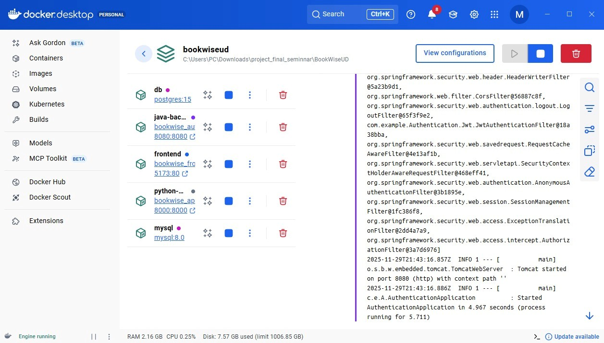
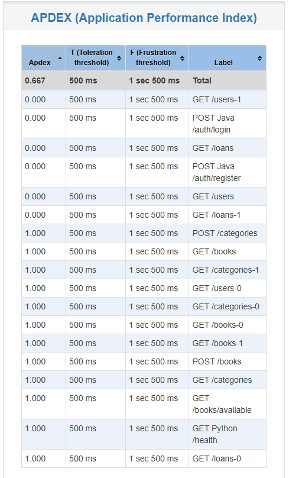

---

# Workshop 4 - Deployment, Acceptance Testing & Stress Testing


---

## 🐳 1. Docker & docker-compose

### Dockerfiles Location

All Dockerfiles are located in the main service directories:

| Component                      | Dockerfile                                 | Language    | Port                  |
| ------------------------------ | ------------------------------------------ | ----------- | --------------------- |
| **Backend Java (Spring Boot)** | `../Code/BackendAuthentication/Dockerfile` | Java 17     | 8080                  |
| **Backend Python (FastAPI)**   | `../Code/Backend/Dockerfile`               | Python 3.11 | 8000                  |
| **Frontend (Vite + React)**    | `../Code/Frontend/Dockerfile`              | Node 18     | 5173 (mapped from 80) |

### Docker Compose Configuration

**File:** `docker-compose.yml` (root level)

**Services:**

* `db` – PostgreSQL 15 (BookWise catalog database)
* `mysql` – MySQL 8.0 (Authentication/Security database)
* `python-backend` – FastAPI service (port 8000)
* `java-backend` – Spring Boot auth service (port 8080)
* `frontend` – Nginx-served Vite app (port 5173)

### How to Run All Services Locally

```powershell
docker-compose up --build
docker-compose up
docker-compose up -d --build
```

**Wait for output:**

```
python-backend-1  | INFO:     Uvicorn running on http://0.0.0.0:8000
java-backend-1    | Started AuthenticationApplication
frontend-1        | [80] INFO: Started server process
```

### Verify Services Are Running

```powershell
docker compose ps
curl http://localhost:8000/health
curl http://localhost:8080/api/auth/status
curl http://localhost:5173
```

### Stop Services

```powershell
docker-compose down
docker-compose down -v
```

---

### 📸 Docker Evidence


---

## 🥒 2. Cucumber Acceptance Testing (Behave)

### Features Location

All feature files are in: `Workshop4/cucumber/features/`

**Available features:**

* `login.feature`
* `register.feature`
* `books.feature`
* `book_management.feature`
* `borrow_return.feature`

### Step Definitions

Located in: `Workshop4/cucumber/features/steps/`

### How to Run Cucumber Tests

```powershell
cd Workshop4/cucumber
python -m pip install -r requirements.txt
behave -f pretty -o results/cucumber_run.txt
behave features/login.feature -f pretty
```

Results stored in:
`Workshop4/cucumber/results/`

---

### 📸 JUnit Evidence


### 📸 PyTest Evidence


---

## 🔥 3. JMeter Stress Testing

### Test Plans

Files in: `Workshop4/jmeter/`

* `testplan.jmx`
* `testplan_all.jmx`

### How to Run JMeter

```powershell
"C:\apache-jmeter\bin\jmeter.bat" -t Workshop4\jmeter\testplan_all.jmx
docker run --rm --network host -v "$(pwd)\Workshop4\jmeter:/testplans" justb4/jmeter:latest -t /testplans/testplan_all.jmx
```

```powershell
"C:\apache-jmeter\bin\jmeter.bat" -n -t "Workshop4\jmeter\testplan_all.jmx" -l "Workshop4\jmeter\results\result_all.jtl" -e -o "Workshop4\jmeter\results\html-report-all"
```

Results in:
`Workshop4/jmeter/results/`

---

### 📸 JMeter Evidence #1




### 📸 JMeter Evidence #2


---

## 🖥️ 4. User Interface Screens

### 📸 UI Evidence #1


### 📸 UI Evidence #2


---

## ⚙️ 5. GitHub Actions CI/CD Pipeline

### Workflow Configuration

File: `.github/workflows/ci.yml`

Workflow includes:

* Setup Python
* Setup Java
* Run PyTest
* Maven package
* Docker builds

---

### 📸 GitHub CI/CD Evidence


---

## 📁 5. Directory Structure

```
BookWiseUD/
├── .github/
│   └── workflows/ci.yml
├── Code/
│   ├── Backend/
│   ├── BackendAuthentication/
│   └── Frontend/
├── Workshop4/
│   ├── docker-compose.yml
│   ├── cucumber/
│   ├── jmeter/
│   └── docker/
└── docker-compose.yml
```

---

## 🚀 Quick Start Guide

```powershell
docker-compose up -d --build
curl http://localhost:8000/health
curl http://localhost:8080
curl http://localhost:5173

cd Workshop4/cucumber
behave -f pretty

cd ../jmeter
docker run --rm --network host -v "$(pwd):/testplans" justb4/jmeter:latest -n -t /testplans/testplan_all.jmx
```

---

## 📊 Test Evidence & Results

### Cucumber

`Workshop4/cucumber/results/cucumber_run.txt`

### JMeter

`Workshop4/jmeter/results/html-report-all/index.html`

### GitHub Actions

Actions tab → latest workflow

---

## 🔧 Troubleshooting

(Docker issues, DB issues, Cucumber fails, JMeter connection errors…)

---

## ✅ Deliverables Checklist

* Dockerfiles
* docker-compose
* Cucumber features
* Step definitions
* JMeter test plans
* JMeter results
* GitHub Actions
* README completo

---

## 📚 References

* Docker docs
* Behave
* JMeter
* GitHub Actions

---


